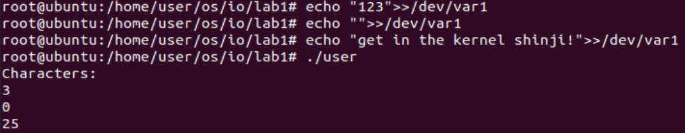
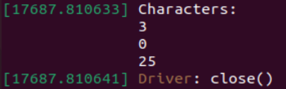

# Лабораторная работа 1

**Название:** "Разработка драйверов символьных устройств"

**Цель работы:** получить знания и навыки разработки драйверов символьных устройств для операционной системы Linux.

## Описание функциональности драйвера

При записи текста в файл символьного устройства должен осуществляться подсчет введенных символов. Последовательность полученных результатов (количество символов) с момента загрузки модуля ядра должна выводиться при чтении созданного файла /proc/varN в консоль пользователя.
При чтении из файла символьного устройства в кольцевой буфер ядра должен осуществляться вывод тех же данных, которые выводятся при чтении файла /proc/varN

## Инструкция по сборке

``make`` -- собирает модуль ядра, компилирует пользовательскую программу `user.c` и загружает модуль ядра `char_mod.ko`

`make clean` -- удаляет объектные файлы и выгружает модуль `char_mod.ko` из ядра

см. `Makefile`

## Инструкция пользователя

1.  `make`
2. Выполнить операции чтения/записи над символьным устройством или `/proc/var1`:
   * `echo "1234">>/dev/var1` -- операция записи в символьное устройство
   * `cat /dev/var1` -- прочитать символьное устройство
   * `./user` -- запуск пользовательской программы, выполняющей чтение `/proc/var1` и выводящей результат (количество введённых в символьное устройство символов). См. `user.c` для подробностей работы
3. Командой `dmesg` можно прочитать кольцевой буфер ядра
4. `make clean` 

## Примеры использования

Кольцевой буфер ядра после команды `cat /dev/var1`:

