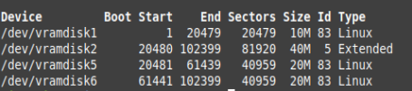
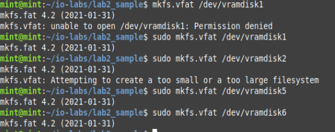
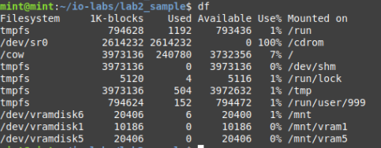

# Лабораторная работа 2

**Название:** "Разработка драйверов блочных устройств"

**Цель работы:** получить знания и навыки разработки дрйверов блочных устройств для операционной системы Linux

## Описание функциональности драйвера

Виртуальный диск со следующей структурой разделов: один первичный раздел размером 10Мбайт и один расширенный раздел, содержащий 2 логических раздела размером 20 Мбайт каждый.

## Инструкция по сборке

1. Собрать модуль ядра командой `make` 
2. Загрузить модуль ядра `sudo insmod block_drv.ko` 

После работы с модулем ядра:
1. Выгрузить модуль `sudo rmmod block_drv.ko`
2. Удалить объектные файлы `make clean`

## Инструкция пользователя

1. Собрать и загрузить модуль ядра по инструкции по сборке
2. `sudo fdisk -l`
3. Выгрузить и удалить модуль по инструкции по сборке

## Примеры использования
Результат работы `sudo fdisk -l`

Форматируем разделы:

Результаты монтирования:

